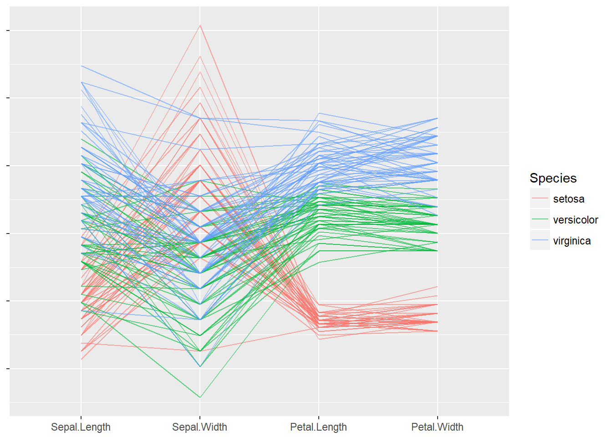

# Exploring Keras in R
A simple notebook exploring the core features of Keras in R using the Iris dataset.
You can check it out using http://htmlpreview.github.io/?https://github.com/ncravino/ExploringKerasR/blob/master/exploringKeras.html
